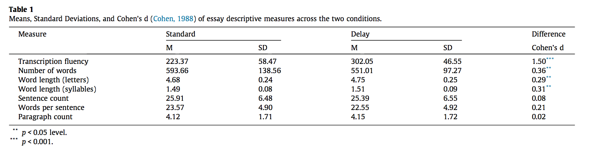
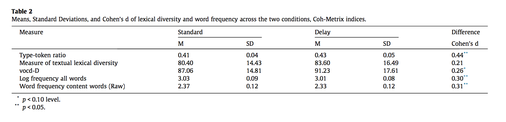
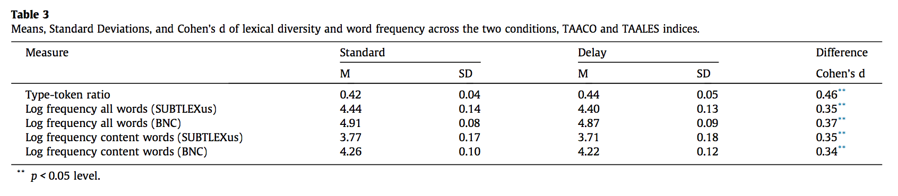

#### Article ID: jCSIW
#### Pilot: Vivian Xiao
#### Co-pilot: Tom Hardwicke  
#### Start date: Mar 12 2017
#### End date: May 10 2017
#### Final verification: Tom Hardwicke
#### Date: Nov 9 2017

-------

#### Methods summary: 
A total of 202 university students were recruited to participate in the experiment. 2 participants were ultimately excluded because of failure to complete the study, making for a total sample of 200 university students. 

Participants were randomly assigned to one of two experimental conditions in a between-subjects design: standard typing condition vs. keyboard delay condition. Participants were given 50 minutes to write an essay about cellphone use in schools, and these essays were meant to be argumentative in nature, at least 500 words long, and participants were told that their essays would be graded. After a 3 minute practice session to get familiarized with the keyboard by typing a sentence, participants wrote their essay. After the 50 minutes ended, participants filled out the NASA Task Load Index (NASA-TLX), which measures subjective fluency. 

The keyboard manipulation was conducted using a QWERTY keyboard and a software program that manipulated the delay between keystrokes. Following pilot tests, the minimum delay that was set using this software was 100ms. The program, as well as Inputlog key-logger (another program), recorded keystroke activity.

The times between consecutive lower case letters, as recorded by the keyboard delay program, was used as a measure of transcription fluency. Outliers (more than 2.5 SD away from the mean) were removed within individual participants - 1.42% of keystrokes were eliminated for 199 participants. Using the Coh-Metrix text analyzer, essays were analyzed for lexical diversity and word frequency. The Tool for the Automatic Analysis of Lexical Sophistication (TAALES) and the Tool for the Automatic Analysis of Cohesion (TAACO) were also used. 

Lexical diversity was defined as the range of vocabulary in a passage of text. Specifically, this means the ratio of unique words to the number of words in a passage of text. A type-token ratio (TTR), a measure of textual lexical diversity (MTLD), and vocd-D are calculated using the Coh-Metrix to operationalize this construct. TTR was also calculated using tbe TAACO measure. Word frequency is defined as how often an individual word occurs in English, with the assumption that passages of text that contain words that are infrequent are more lexically sophisticated. The Coh-Metrix uses the CELEX database to calculate the log-frequency for all words used as well as the raw frequencies for content words. SUBTLEXus and the British National Corpus databases are used by TAALES to assess word frequency as well. Further, three independent raters who were blind to condition scored the essays using a 6 point scale similar to that used by the ACT writing test. All raters were trained using the same rubric and a pool of argumentative essays separate from this study. Average interrater reliability reached r > .5 on these training trials, and when the essays from this study were scored, the interrater reliability was adequate, r(198) = .56, p < .001. The mean of the two raters' scores with the highest correlation were used as the ultimate score assigned to each essay. The score closest to the third rater's score was used in the event that the differences between the two raters were greater than or equal to 1.

------

#### Target outcomes: 
> A series of one-way ANOVAs were performed with condition (standard vs. keyboard delay) as the factor and transcription fluency, lexical sophistication, subjective fluency, and essay quality as the dependent variables.

> 3.1. Descriptive essay indices

> Condition affected transcription fluency such that it was more fluent in the standard condition, F(1, 197) = 110.14, MSE = 2796.13, p < 0.001, d = 1.50. While there were more words typed in the standard condition, F(1, 198) = 6.35, MSE = 14329.49, p = 0.013, d = 0.36, essays in the delay condition contained longer words (letters and syllables per word), Fs > 4.17, ps < 0.043, ds > 0.28. There were no other differences (see Table 1).

> 3.2. Lexical sophistication

> Condition had a significant effect on type-token ratio, F(1, 198) = 9.70, MSE = 0.002, p = 0.002, d = 0.44, and vocd-D (marginally), F(1, 198) = 3.29, MSE = 264.62, p = 0.071, d = 0.26, such that they were higher in the delay condition. There was no effect on the measure of textual lexical diversity, F(1, 198) = 2.13, MSE = 239.96, p = 0.146, d = 0.21, though the pattern of means was in the same direction. Moreover, condition had an effect on both word frequency indices such that they were lower in the delay condition, log word frequency-all words, F(1, 198) = 4.49, MSE = 0.01, p = 0.035, d = 0.30, raw word frequency-content words, F(1, 198) = 4.74, MSE = 0.02, p = 0.031, d = 0.31 (see Table 2). The results were similar when lexical diversity and word frequency from TAACO and TAALES were used (see Table 3) (from Medimorec et al., p. 30).

------

```{r global_options, include=FALSE}
knitr::opts_chunk$set(echo=TRUE, warning=FALSE, message=FALSE)

# prepare an empty report object, we will update this each time we run compareValues2()
reportObject <- data.frame("Article_ID" = NA, "valuesChecked" = 0, "eyeballs" = 0, "Total_df" = 0, "Total_p" = 0, "Total_mean" = 0, "Total_sd" = 0, "Total_se" = 0, "Total_ci" = 0, "Total_bf" = 0, "Total_t" = 0, "Total_F" = 0, "Total_es" = 0, "Total_median" = 0, "Total_irr" = 0, "Total_r" = 0, "Total_z" = 0, "Total_coeff" = 0, "Total_n" = 0, "Total_x2" = 0, "Total_other" = 0, "Insufficient_Information_Errors" = 0, "Decision_Errors" = 0, "Major_Numerical_Errors" = 0, "Minor_Numerical_Errors" = 0, "Major_df" = 0, "Major_p" = 0, "Major_mean" = 0, "Major_sd" = 0, "Major_se" = 0, "Major_ci" = 0, "Major_bf" = 0, "Major_t" = 0, "Major_F" = 0, "Major_es" = 0, "Major_median" = 0, "Major_irr" = 0, "Major_r" = 0, "Major_z" = 0, "Major_coeff" = 0, "Major_n" = 0, "Major_x2" = 0, "Major_other" = 0, "affectsConclusion" = NA, "error_typo" = 0, "error_specification" = 0, "error_analysis" = 0, "error_data" = 0, "error_unidentified" = 0, "Author_Assistance" = NA, "resolved_typo" = 0, "resolved_specification" = 0, "resolved_analysis" = 0, "resolved_data" = 0, "correctionSuggested" = NA, "correctionPublished" = NA)
```

## Step 1: Load packages

```{r}
library(tidyverse) # for data munging
library(knitr) # for kable table formating
library(haven) # import and export 'SPSS', 'Stata' and 'SAS' Files
library(readxl) # import excel files
library(CODreports) # custom report functions
library(lsr) # for effect size calculation
```

## Step 2: Load data

First, we load the datasets necessary to carry out this reproduction of results.
```{r}
d1 <- read.csv("data/data1.csv", stringsAsFactors = F)
d2 <- read.csv("data/data2.csv", stringsAsFactors = F)
```

## Step 3: Tidy data

Next, we join the two datasets to recreate the full dataset that was likely used in the original analyses.
```{r}
d.tidy <- left_join(d1, d2)
```
Format some columns:
```{r}
d.tidy <- d.tidy %>% mutate(Transcription_Fluency = as.numeric(Transcription_Fluency),
                  Participant = factor(Participant),
                  Condition = factor(Condition_0.Standard))
```

## Step 4: Run analysis

### Descriptive statistics

Here, we calculate the means and standard deviations of each of the recorded DV's broken down by condition in order to attempt to recreate Medimorec et al.'s reported table of means and standard deviations.

First we will try to reproduce Table 1:



```{r}
m_fluency = mean(d.tidy$Transcription_Fluency[d.tidy$Condition_0.Standard == "0"], na.rm=T)
reportObject <- compareValues2(reportedValue = "223.37", obtainedValue = m_fluency, valueType = 'mean')
sd_fluency = sd(d.tidy$Transcription_Fluency[d.tidy$Condition_0.Standard == "0"], na.rm = T)
reportObject <- compareValues2(reportedValue = "58.47", obtainedValue = sd_fluency, valueType = 'sd')

m_fluency2 = mean(d.tidy$Transcription_Fluency[d.tidy$Condition_0.Standard == "1"], na.rm = T)
reportObject <- compareValues2(reportedValue = "302.05", obtainedValue = m_fluency2, valueType = 'mean')
sd_fluency2 = sd(d.tidy$Transcription_Fluency[d.tidy$Condition_0.Standard == "1"], na.rm = T)
reportObject <- compareValues2(reportedValue = "46.55", obtainedValue = sd_fluency2, valueType = 'sd')

d <- cohensD(d.tidy$Transcription_Fluency[d.tidy$Condition_0.Standard == "0"], d.tidy$Transcription_Fluency[d.tidy$Condition_0.Standard == "1"], method = 'raw')

reportObject <- compareValues2(reportedValue = "1.50", obtainedValue = d, valueType = 'es')

m_numwords = mean(d.tidy$Number_of_Words[d.tidy$Condition_0.Standard == "0"], na.rm=T)
reportObject <- compareValues2(reportedValue = "593.66", obtainedValue = m_numwords, valueType = 'mean')
sd_numwords = sd(d.tidy$Number_of_Words[d.tidy$Condition_0.Standard == "0"], na.rm = T)
reportObject <- compareValues2(reportedValue = "138.56", obtainedValue = sd_numwords, valueType = 'sd')

m_numwords2 = mean(d.tidy$Number_of_Words[d.tidy$Condition_0.Standard == "1"], na.rm = T)
reportObject <- compareValues2(reportedValue = "551.01", obtainedValue = m_numwords2, valueType = 'mean')
sd_numwords2 = sd(d.tidy$Number_of_Words[d.tidy$Condition_0.Standard == "1"], na.rm = T)
reportObject <- compareValues2(reportedValue = "97.27", obtainedValue = sd_numwords2, valueType = 'sd')

d <- cohensD(d.tidy$Number_of_Words[d.tidy$Condition_0.Standard == "0"], d.tidy$Number_of_Words[d.tidy$Condition_0.Standard == "1"], method = 'raw')

reportObject <- compareValues2(reportedValue = "0.36", obtainedValue = d, valueType = 'es')

m_lengthl = mean(d.tidy$Letters_Per_Word[d.tidy$Condition_0.Standard == "0"], na.rm=T)
reportObject <- compareValues2(reportedValue = "4.68", obtainedValue = m_lengthl, valueType = 'mean')
sd_lengthl = sd(d.tidy$Letters_Per_Word[d.tidy$Condition_0.Standard == "0"], na.rm = T)
reportObject <- compareValues2(reportedValue = "0.24", obtainedValue = sd_lengthl, valueType = 'sd')

m_lengthl2 = mean(d.tidy$Letters_Per_Word[d.tidy$Condition_0.Standard == "1"], na.rm = T)
reportObject <- compareValues2(reportedValue = "4.75", obtainedValue = m_lengthl2, valueType = 'mean')
sd_lengthl2 = sd(d.tidy$Letters_Per_Word[d.tidy$Condition_0.Standard == "1"], na.rm = T)
reportObject <- compareValues2(reportedValue = "0.25", obtainedValue = sd_lengthl2, valueType = 'sd')

d <- cohensD(d.tidy$Letters_Per_Word[d.tidy$Condition_0.Standard == "0"], d.tidy$Letters_Per_Word[d.tidy$Condition_0.Standard == "1"], method = 'raw')

reportObject <- compareValues2(reportedValue = "0.29", obtainedValue = d, valueType = 'es')

m_lengths = mean(d.tidy$Syllables_Per_Word[d.tidy$Condition_0.Standard == "0"], na.rm=T)
reportObject <- compareValues2(reportedValue = "1.49", obtainedValue = m_lengths, valueType = 'mean')
sd_lengths = sd(d.tidy$Syllables_Per_Word[d.tidy$Condition_0.Standard == "0"], na.rm = T)
reportObject <- compareValues2(reportedValue = "0.08", obtainedValue = sd_lengths, valueType = 'mean')

m_lengths2 = mean(d.tidy$Syllables_Per_Word[d.tidy$Condition_0.Standard == "1"], na.rm = T)
reportObject <- compareValues2(reportedValue = "1.51", obtainedValue = m_lengths2, valueType = 'mean')
sd_lengths2 = sd(d.tidy$Syllables_Per_Word[d.tidy$Condition_0.Standard == "1"], na.rm = T)
reportObject <- compareValues2(reportedValue = "0.09", obtainedValue = sd_lengths2, valueType = 'sd')

d <- cohensD(d.tidy$Syllables_Per_Word[d.tidy$Condition_0.Standard == "0"], d.tidy$Syllables_Per_Word[d.tidy$Condition_0.Standard == "1"], method = 'raw')

reportObject <- compareValues2(reportedValue = "0.31", obtainedValue = d, valueType = 'es')

m_sentence = mean(d.tidy$Sentence_count[d.tidy$Condition_0.Standard == "0"], na.rm=T)
reportObject <- compareValues2(reportedValue = "25.91", obtainedValue = m_sentence, valueType = 'mean')
sd_sentence = sd(d.tidy$Sentence_count[d.tidy$Condition_0.Standard == "0"], na.rm = T)
reportObject <- compareValues2(reportedValue = "6.48", obtainedValue = sd_sentence, valueType = 'sd')

m_sentence2 = mean(d.tidy$Sentence_count[d.tidy$Condition_0.Standard == "1"], na.rm = T)
reportObject <- compareValues2(reportedValue = "25.39", obtainedValue = m_sentence2, valueType = 'mean')
sd_sentence2 = sd(d.tidy$Sentence_count[d.tidy$Condition_0.Standard == "1"], na.rm = T)
reportObject <- compareValues2(reportedValue = "6.55", obtainedValue = sd_sentence2, valueType = 'sd')

d <- cohensD(d.tidy$Sentence_count[d.tidy$Condition_0.Standard == "0"], d.tidy$Sentence_count[d.tidy$Condition_0.Standard == "1"], method = 'raw')

reportObject <- compareValues2(reportedValue = "0.08", obtainedValue = d, valueType = 'es')

m_wordsper = mean(d.tidy$words_per_sentence[d.tidy$Condition_0.Standard == "0"], na.rm=T)
reportObject <- compareValues2(reportedValue = "23.57", obtainedValue = m_wordsper, valueType = 'mean')
sd_wordsper = sd(d.tidy$words_per_sentence[d.tidy$Condition_0.Standard == "0"], na.rm = T)
reportObject <- compareValues2(reportedValue = "4.90", obtainedValue = sd_wordsper, valueType = 'sd')

m_wordsper2 = mean(d.tidy$words_per_sentence[d.tidy$Condition_0.Standard == "1"], na.rm = T)
reportObject <- compareValues2(reportedValue = "22.55", obtainedValue = m_wordsper2, valueType = 'mean')
sd_wordsper2 = sd(d.tidy$words_per_sentence[d.tidy$Condition_0.Standard == "1"], na.rm = T)
reportObject <- compareValues2(reportedValue = "4.92", obtainedValue = sd_wordsper2, valueType = 'sd')

d <- cohensD(d.tidy$words_per_sentence[d.tidy$Condition_0.Standard == "0"], d.tidy$words_per_sentence[d.tidy$Condition_0.Standard == "1"], method = 'raw')

reportObject <- compareValues2(reportedValue = "0.21", obtainedValue = d, valueType = 'es')

m_paragraph = mean(d.tidy$paragraph_count[d.tidy$Condition_0.Standard == "0"], na.rm=T)
reportObject <- compareValues2(reportedValue = "4.12", obtainedValue = m_paragraph, valueType = 'mean')
sd_paragraph = sd(d.tidy$paragraph_count[d.tidy$Condition_0.Standard == "0"], na.rm = T)
reportObject <- compareValues2(reportedValue = "1.71", obtainedValue = sd_paragraph, valueType = 'sd')

m_paragraph2 = mean(d.tidy$paragraph_count[d.tidy$Condition_0.Standard == "1"], na.rm = T)
reportObject <- compareValues2(reportedValue = "4.15", obtainedValue = m_paragraph2, valueType = 'mean')
sd_paragraph2 = sd(d.tidy$paragraph_count[d.tidy$Condition_0.Standard == "1"], na.rm = T)
reportObject <- compareValues2(reportedValue = "1.72", obtainedValue = sd_paragraph2, valueType = 'sd')

d <- cohensD(d.tidy$paragraph_count[d.tidy$Condition_0.Standard == "0"], d.tidy$paragraph_count[d.tidy$Condition_0.Standard == "1"], method = 'raw')

reportObject <- compareValues2(reportedValue = "0.02", obtainedValue = d, valueType = 'es')

t1 = as.table(matrix(c(m_fluency,sd_fluency,m_fluency2,sd_fluency2,m_numwords,sd_numwords,m_numwords2,sd_numwords2,m_lengthl, sd_lengthl,m_lengthl2,sd_lengthl2,m_lengths,sd_lengths,m_lengths2,sd_lengths2,m_sentence,sd_sentence, m_sentence2,sd_sentence2, m_wordsper, sd_wordsper,m_wordsper2,sd_wordsper2,m_paragraph,sd_paragraph,m_paragraph2, sd_paragraph2), byrow=T, ncol=4,
              dimnames=list(measure=c("transcription fluency","number of words", "word length (letters)", "world length (syllables)", "sentence count", "words per sentence", "paragraph count"),
                            statistic=c("m (standard)", "sd (standard)", "m (delay)", "sd (delay)"))))
```


```{r}
kable(t1, digits = 2)
```

All values appear to match.

Now try to reproduce Table 2:



```{r}
m_ttr = mean(d.tidy$Type.Token_Ratio[d.tidy$Condition_0.Standard == "0"])
reportObject <- compareValues2(reportedValue = "0.41", obtainedValue = m_ttr, valueType = 'mean')
sd_ttr = sd(d.tidy$Type.Token_Ratio[d.tidy$Condition_0.Standard == "0"])
reportObject <- compareValues2(reportedValue = "0.04", obtainedValue = sd_ttr, valueType = 'sd')

m_ttr2 = mean(d.tidy$Type.Token_Ratio[d.tidy$Condition_0.Standard == "1"])
reportObject <- compareValues2(reportedValue = "0.43", obtainedValue = m_ttr2, valueType = 'mean')
sd_ttr2 = sd(d.tidy$Type.Token_Ratio[d.tidy$Condition_0.Standard == "1"])
reportObject <- compareValues2(reportedValue = "0.05", obtainedValue = sd_ttr2, valueType = 'sd')

d <- cohensD(d.tidy$Type.Token_Ratio[d.tidy$Condition_0.Standard == "0"], d.tidy$Type.Token_Ratio[d.tidy$Condition_0.Standard == "1"], method = 'raw')
reportObject <- compareValues2(reportedValue = "0.44", obtainedValue = d, valueType = 'es')

m_mtld = mean(d.tidy$Measure_of_Textual_Lexical_Diversity_MTLD[d.tidy$Condition_0.Standard == "0"])
reportObject <- compareValues2(reportedValue = "80.40", obtainedValue = m_mtld, valueType = 'mean')
sd_mtld = sd(d.tidy$Measure_of_Textual_Lexical_Diversity_MTLD[d.tidy$Condition_0.Standard == "0"])
reportObject <- compareValues2(reportedValue = "14.43", obtainedValue = sd_mtld, valueType = 'sd')

m_mtld2 = mean(d.tidy$Measure_of_Textual_Lexical_Diversity_MTLD[d.tidy$Condition_0.Standard == "1"])
reportObject <- compareValues2(reportedValue = "83.60", obtainedValue = m_mtld2, valueType = 'mean')
sd_mtld2 = sd(d.tidy$Measure_of_Textual_Lexical_Diversity_MTLD[d.tidy$Condition_0.Standard == "1"])
reportObject <- compareValues2(reportedValue = "16.49", obtainedValue = sd_mtld2, valueType = 'sd')

d <- cohensD(d.tidy$Measure_of_Textual_Lexical_Diversity_MTLD[d.tidy$Condition_0.Standard == "0"], d.tidy$Measure_of_Textual_Lexical_Diversity_MTLD[d.tidy$Condition_0.Standard == "1"], method = 'raw')
reportObject <- compareValues2(reportedValue = "0.21", obtainedValue = d, valueType = 'es')

m_vocd = mean(d.tidy$vocdD_Lexical_Diversity[d.tidy$Condition_0.Standard == "0"])
reportObject <- compareValues2(reportedValue = "87.06", obtainedValue = m_vocd, valueType = 'mean')
sd_vocd = sd(d.tidy$vocdD_Lexical_Diversity[d.tidy$Condition_0.Standard == "0"])
reportObject <- compareValues2(reportedValue = "14.81", obtainedValue = sd_vocd, valueType = 'sd')

m_vocd2 = mean(d.tidy$vocdD_Lexical_Diversity[d.tidy$Condition_0.Standard == "1"])
reportObject <- compareValues2(reportedValue = "91.23", obtainedValue = m_vocd2, valueType = 'mean')
sd_vocd2 = sd(d.tidy$vocdD_Lexical_Diversity[d.tidy$Condition_0.Standard == "1"])
reportObject <- compareValues2(reportedValue = "17.61", obtainedValue = sd_vocd2, valueType = 'sd')

d <- cohensD(d.tidy$vocdD_Lexical_Diversity[d.tidy$Condition_0.Standard == "0"], d.tidy$vocdD_Lexical_Diversity[d.tidy$Condition_0.Standard == "1"], method = 'raw')
reportObject <- compareValues2(reportedValue = "0.26", obtainedValue = d, valueType = 'es')

m_logfreq = mean(d.tidy$Word_Frequency_all_words_log[d.tidy$Condition_0.Standard == "0"])
reportObject <- compareValues2(reportedValue = "3.03", obtainedValue = m_logfreq, valueType = 'mean')
sd_logfreq = sd(d.tidy$Word_Frequency_all_words_log[d.tidy$Condition_0.Standard == "0"])
reportObject <- compareValues2(reportedValue = "0.09", obtainedValue = sd_logfreq, valueType = 'sd')

m_logfreq2 = mean(d.tidy$Word_Frequency_all_words_log[d.tidy$Condition_0.Standard == "1"])
reportObject <- compareValues2(reportedValue = "3.01", obtainedValue = m_logfreq2, valueType = 'mean')
sd_logfreq2 = sd(d.tidy$Word_Frequency_all_words_log[d.tidy$Condition_0.Standard == "1"])
sd_logfreq = sd(d.tidy$Word_Frequency_all_words_log[d.tidy$Condition_0.Standard == "0"])
reportObject <- compareValues2(reportedValue = "0.08", obtainedValue = sd_logfreq2, valueType = 'sd')

d <- cohensD(d.tidy$Word_Frequency_all_words_log[d.tidy$Condition_0.Standard == "0"], d.tidy$Word_Frequency_all_words_log[d.tidy$Condition_0.Standard == "1"], method = 'raw')
reportObject <- compareValues2(reportedValue = "0.30", obtainedValue = d, valueType = 'es')

m_rawfreq = mean(d.tidy$Word_Frequency_content_words_raw[d.tidy$Condition_0.Standard == "0"])
reportObject <- compareValues2(reportedValue = "2.37", obtainedValue = m_rawfreq, valueType = 'mean')
sd_rawfreq = sd(d.tidy$Word_Frequency_content_words_raw[d.tidy$Condition_0.Standard == "0"])
reportObject <- compareValues2(reportedValue = "0.12", obtainedValue = sd_rawfreq, valueType = 'sd')

m_rawfreq2 = mean(d.tidy$Word_Frequency_content_words_raw[d.tidy$Condition_0.Standard == "1"])
reportObject <- compareValues2(reportedValue = "2.33", obtainedValue = m_rawfreq2, valueType = 'mean')
sd_rawfreq2 = sd(d.tidy$Word_Frequency_content_words_raw[d.tidy$Condition_0.Standard == "1"])
reportObject <- compareValues2(reportedValue = "0.12", obtainedValue = sd_rawfreq2, valueType = 'sd')

d <- cohensD(d.tidy$Word_Frequency_content_words_raw[d.tidy$Condition_0.Standard == "0"], d.tidy$Word_Frequency_content_words_raw[d.tidy$Condition_0.Standard == "1"], method = 'raw')
reportObject <- compareValues2(reportedValue = "0.31", obtainedValue = d, valueType = 'es')

t2 = as.table(matrix(c(m_ttr, sd_ttr, m_ttr2, sd_ttr2, m_mtld, sd_mtld, m_mtld2, sd_mtld2,m_vocd,sd_vocd,m_vocd2,sd_vocd2,m_logfreq,sd_logfreq,m_logfreq2, sd_logfreq2, m_rawfreq,sd_rawfreq, m_rawfreq2,sd_rawfreq2), byrow=T, ncol=4,
              dimnames=list(measure=c("type-token ratio", "measure of textual lexical diversity","vocd-D", "log frequency all words", "word frequency content words (raw)"),
                            statistic=c("m (standard)", "sd (standard)", "m (delay)", "sd (delay)"))))
```


```{r}
kable(t2, digits = 2)
```

All values appear to match.

Now try to reproduce Table 3:



```{r}
m_ttr3 = mean(d.tidy$type.token_ratio_TAACO[d.tidy$Condition_0.Standard == "0"])
reportObject <- compareValues2(reportedValue = "0.42", obtainedValue = m_ttr3, valueType = 'mean')
sd_ttr3 = sd(d.tidy$type.token_ratio_TAACO[d.tidy$Condition_0.Standard == "0"])
reportObject <- compareValues2(reportedValue = "0.04", obtainedValue = sd_ttr3, valueType = 'sd')

m_ttr4 = mean(d.tidy$type.token_ratio_TAACO[d.tidy$Condition_0.Standard == "1"])
reportObject <- compareValues2(reportedValue = "0.44", obtainedValue = m_ttr4, valueType = 'mean')
sd_ttr4 = sd(d.tidy$type.token_ratio_TAACO[d.tidy$Condition_0.Standard == "1"])
reportObject <- compareValues2(reportedValue = "0.005", obtainedValue = sd_ttr4, valueType = 'sd')

d <- cohensD(d.tidy$type.token_ratio_TAACO[d.tidy$Condition_0.Standard == "0"], d.tidy$type.token_ratio_TAACO[d.tidy$Condition_0.Standard == "1"], method = 'raw')
reportObject <- compareValues2(reportedValue = "0.46", obtainedValue = d, valueType = 'es')

m_allsub = mean(d.tidy$SUBTLEXusFreq_ALL_Words_Log[d.tidy$Condition_0.Standard == "0"])
reportObject <- compareValues2(reportedValue = "4.44", obtainedValue = m_allsub, valueType = 'mean')
sd_allsub = sd(d.tidy$SUBTLEXusFreq_ALL_Words_Log[d.tidy$Condition_0.Standard == "0"])
reportObject <- compareValues2(reportedValue = "0.14", obtainedValue = sd_allsub, valueType = 'sd')

m_allsub2 = mean(d.tidy$SUBTLEXusFreq_ALL_Words_Log[d.tidy$Condition_0.Standard == "1"])
reportObject <- compareValues2(reportedValue = "4.40", obtainedValue = m_allsub2, valueType = 'mean')
sd_allsub2 = sd(d.tidy$SUBTLEXusFreq_ALL_Words_Log[d.tidy$Condition_0.Standard == "1"])
reportObject <- compareValues2(reportedValue = "0.13", obtainedValue = sd_allsub2, valueType = 'sd')

d <- cohensD(d.tidy$SUBTLEXusFreq_ALL_Words_Log[d.tidy$Condition_0.Standard == "0"], d.tidy$SUBTLEXusFreq_ALL_Words_Log[d.tidy$Condition_0.Standard == "1"], method = 'raw')
reportObject <- compareValues2(reportedValue = "0.35", obtainedValue = d, valueType = 'es')

m_allbnc = mean(d.tidy$BNCWrittenFreq_AllWords_Log[d.tidy$Condition_0.Standard == "0"])
reportObject <- compareValues2(reportedValue = "4.91", obtainedValue = m_allbnc, valueType = 'mean')

sd_allbnc = sd(d.tidy$BNCWrittenFreq_AllWords_Log[d.tidy$Condition_0.Standard == "0"])
reportObject <- compareValues2(reportedValue = "0.08", obtainedValue = sd_allbnc, valueType = 'sd')

m_allbnc2 = mean(d.tidy$BNCWrittenFreq_AllWords_Log[d.tidy$Condition_0.Standard == "1"])
reportObject <- compareValues2(reportedValue = "4.87", obtainedValue = m_allbnc2, valueType = 'mean')

sd_allbnc2 = sd(d.tidy$BNCWrittenFreq_AllWords_Log[d.tidy$Condition_0.Standard == "1"])
reportObject <- compareValues2(reportedValue = "0.09", obtainedValue = sd_allbnc2, valueType = 'sd')

d <- cohensD(d.tidy$BNCWrittenFreq_AllWords_Log[d.tidy$Condition_0.Standard == "0"], d.tidy$BNCWrittenFreq_AllWords_Log[d.tidy$Condition_0.Standard == "1"], method = 'raw')
reportObject <- compareValues2(reportedValue = "0.37", obtainedValue = d, valueType = 'es')

m_contentsub = mean(d.tidy$SUBTLEXusFreq_Content_Words_Log[d.tidy$Condition_0.Standard == "0"])
reportObject <- compareValues2(reportedValue = "3.77", obtainedValue = m_contentsub, valueType = 'mean')

sd_contentsub = sd(d.tidy$SUBTLEXusFreq_Content_Words_Log[d.tidy$Condition_0.Standard == "0"])
reportObject <- compareValues2(reportedValue = "0.17", obtainedValue = sd_contentsub, valueType = 'sd')

m_contentsub2 = mean(d.tidy$SUBTLEXusFreq_Content_Words_Log[d.tidy$Condition_0.Standard == "1"])
reportObject <- compareValues2(reportedValue = "3.71", obtainedValue = m_contentsub2, valueType = 'mean')
sd_contentsub2 = sd(d.tidy$SUBTLEXusFreq_Content_Words_Log[d.tidy$Condition_0.Standard == "1"])
reportObject <- compareValues2(reportedValue = "0.18", obtainedValue = sd_contentsub2, valueType = 'sd')

d <- cohensD(d.tidy$SUBTLEXusFreq_Content_Words_Log[d.tidy$Condition_0.Standard == "0"], d.tidy$SUBTLEXusFreq_Content_Words_Log[d.tidy$Condition_0.Standard == "1"], method = 'raw')
reportObject <- compareValues2(reportedValue = "0.35", obtainedValue = d, valueType = 'es')

m_contentbnc = mean(d.tidy$BNCWrittenFreq_Content_Words_Log[d.tidy$Condition_0.Standard == "0"])
reportObject <- compareValues2(reportedValue = "4.26", obtainedValue = m_contentbnc, valueType = 'mean')

sd_contentbnc = sd(d.tidy$BNCWrittenFreq_Content_Words_Log[d.tidy$Condition_0.Standard == "0"])
reportObject <- compareValues2(reportedValue = "0.10", obtainedValue = sd_contentbnc, valueType = 'sd')

m_contentbnc2 = mean(d.tidy$BNCWrittenFreq_Content_Words_Log[d.tidy$Condition_0.Standard == "1"])
reportObject <- compareValues2(reportedValue = "4.22", obtainedValue = m_contentbnc2, valueType = 'mean')

sd_contentbnc2 = sd(d.tidy$BNCWrittenFreq_Content_Words_Log[d.tidy$Condition_0.Standard == "1"])
reportObject <- compareValues2(reportedValue = "0.12", obtainedValue = sd_contentbnc2, valueType = 'sd')

d <- cohensD(d.tidy$BNCWrittenFreq_Content_Words_Log[d.tidy$Condition_0.Standard == "0"], d.tidy$BNCWrittenFreq_Content_Words_Log[d.tidy$Condition_0.Standard == "1"], method = 'raw')
reportObject <- compareValues2(reportedValue = "0.34", obtainedValue = d, valueType = 'es')

t3 = as.table(matrix(c(m_ttr3, sd_ttr3, m_ttr4, sd_ttr4, m_allsub, sd_allsub, m_allsub2, sd_allsub2, m_allbnc, sd_allbnc, m_allbnc2,sd_allbnc2,m_contentsub, sd_contentsub, m_contentsub2, sd_contentsub2, m_contentbnc, sd_contentbnc, m_contentbnc2, sd_contentbnc2), byrow=T, ncol=4,
              dimnames=list(measure=c("type-token ratio", "log frequency all words(SUBTLEXus)", "log frequency all words (BNC)", "log frequency content words (SUBTLEXus)", "log frequency content words (BNC)"),
                            statistic=c("m (standard)", "sd (standard)", "m (delay)", "sd (delay)"))))
```


```{r}
kable(t3, digits = 2)
```

All values appear to match.

### Inferential statistics

We first attempt to reproduce the analyses of descriptive essay indices:

> 3.1. Descriptive essay indices

> Condition affected transcription fluency such that it was more fluent in the standard condition, F(1, 197) = 110.14, MSE = 2796.13, p < 0.001

```{r}
rs1 = summary(aov(Transcription_Fluency ~ Condition, d.tidy))
reportObject <- compareValues2(reportedValue = "1", obtainedValue = rs1[[1]]$Df[1], valueType = 'df')
reportObject <- compareValues2(reportedValue = "197", obtainedValue = rs1[[1]]$Df[2], valueType = 'df')
reportObject <- compareValues2(reportedValue = "110.14", obtainedValue = rs1[[1]]$`F value`[1], valueType = 'F')
reportObject <- compareValues2(reportedValue = "2796.13", obtainedValue = rs1[[1]]$`Mean Sq`[2], valueType = 'other')
reportObject <- compareValues2(reportedValue = "eyeballMATCH", obtainedValue = rs1[[1]]$`Pr(>F)`, valueType = 'p')
```

>  While there were more words typed in the standard condition, F(1, 198) = 6.35, MSE = 14329.49, p = 0.013, d = 0.36

```{r}
rs2 = summary(aov(Number_of_Words ~ Condition, data = d.tidy))
reportObject <- compareValues2(reportedValue = "1", obtainedValue = rs2[[1]]$Df[1], valueType = 'df')
reportObject <- compareValues2(reportedValue = "198", obtainedValue = rs2[[1]]$Df[2], valueType = 'df')
reportObject <- compareValues2(reportedValue = "6.35", obtainedValue = rs2[[1]]$`F value`[1], valueType = 'F')
reportObject <- compareValues2(reportedValue = "14329.49", obtainedValue = rs2[[1]]$`Mean Sq`[2], valueType = 'other')
reportObject <- compareValues2(reportedValue = "0.013", obtainedValue = rs2[[1]]$`Pr(>F)`[1], valueType = 'p')
```

Next, we reproduce Medimorac et al.'s analyses of lexical sophistication, using the Coh-Metrix source as well as the TAACO and TAALES sources:

> 3.2. Lexical sophistication

> Condition had a significant effect on type-token ratio, F(1, 198) = 9.70, MSE = 0.002, p = 0.002, d = 0.44

```{r}
rs8 = summary(aov(Type.Token_Ratio ~ Condition, data = d.tidy))

reportObject <- compareValues2(reportedValue = "1", obtainedValue = rs8[[1]]$Df[1], valueType = 'df')
reportObject <- compareValues2(reportedValue = "198", obtainedValue = rs8[[1]]$Df[2], valueType = 'df')
reportObject <- compareValues2(reportedValue = "9.70", obtainedValue = rs8[[1]]$`F value`[1], valueType = 'F')
reportObject <- compareValues2(reportedValue = "0.002", obtainedValue = rs8[[1]]$`Mean Sq`[2], valueType = 'other')
reportObject <- compareValues2(reportedValue = "0.002", obtainedValue = rs8[[1]]$`Pr(>F)`[1], valueType = 'p')
```

> and vocd-D (marginally), F(1, 198) = 3.29, MSE = 264.62, p = 0.071, d = 0.26, such that they were higher in the delay condition. 
 
```{r} 
rs9 = summary(aov(vocdD_Lexical_Diversity ~ Condition, data = d.tidy))

reportObject <- compareValues2(reportedValue = "1", obtainedValue = rs9[[1]]$Df[1], valueType = 'df')
reportObject <- compareValues2(reportedValue = "198", obtainedValue = rs9[[1]]$Df[2], valueType = 'df')
reportObject <- compareValues2(reportedValue = "3.29", obtainedValue = rs9[[1]]$`F value`[1], valueType = 'F')
reportObject <- compareValues2(reportedValue = "264.62", obtainedValue = rs9[[1]]$`Mean Sq`[2], valueType = 'other')
reportObject <- compareValues2(reportedValue = "0.071", obtainedValue = rs9[[1]]$`Pr(>F)`[1], valueType = 'p')
```

> There was no effect on the measure of textual lexical diversity, F(1, 198) = 2.13, MSE = 239.96, p = 0.146, d = 0.21, though the pattern of means was in the same direction. 

```{r}
rs10 = summary(aov(Measure_of_Textual_Lexical_Diversity_MTLD ~ Condition, data = d.tidy))

reportObject <- compareValues2(reportedValue = "1", obtainedValue = rs10[[1]]$Df[1], valueType = 'df')
reportObject <- compareValues2(reportedValue = "198", obtainedValue = rs10[[1]]$Df[2], valueType = 'df')
reportObject <- compareValues2(reportedValue = "2.14", obtainedValue = rs10[[1]]$`F value`[1], valueType = 'F')
reportObject <- compareValues2(reportedValue = "239.96", obtainedValue = rs10[[1]]$`Mean Sq`[2], valueType = 'other')
reportObject <- compareValues2(reportedValue = "0.146", obtainedValue = rs10[[1]]$`Pr(>F)`[1], valueType = 'p')
```

> Moreover, condition had an effect on both word frequency indices such that they were lower in the delay condition, log word frequency-all words, F(1, 198) = 4.49, MSE = 0.01, p = 0.035, d = 0.30, 

```{r}
rs11 = summary(aov(Word_Frequency_all_words_log ~ Condition, data = d.tidy))

reportObject <- compareValues2(reportedValue = "1", obtainedValue = rs11[[1]]$Df[1], valueType = 'df')
reportObject <- compareValues2(reportedValue = "198", obtainedValue = rs11[[1]]$Df[2], valueType = 'df')
reportObject <- compareValues2(reportedValue = "4.49", obtainedValue = rs11[[1]]$`F value`[1], valueType = 'F')
reportObject <- compareValues2(reportedValue = "0.01", obtainedValue = rs11[[1]]$`Mean Sq`[2], valueType = 'other')
reportObject <- compareValues2(reportedValue = "0.035", obtainedValue = rs11[[1]]$`Pr(>F)`[1], valueType = 'p')
```

> raw word frequency-content words, F(1, 198) = 4.74, MSE = 0.02, p = 0.031, d = 0.31 (see Table 2). 

```{r}
rs12 = summary(aov(Word_Frequency_content_words_raw ~ Condition, data = d.tidy))

reportObject <- compareValues2(reportedValue = "1", obtainedValue = rs12[[1]]$Df[1], valueType = 'df')
reportObject <- compareValues2(reportedValue = "198", obtainedValue = rs12[[1]]$Df[2], valueType = 'df')
reportObject <- compareValues2(reportedValue = "4.74", obtainedValue = rs12[[1]]$`F value`[1], valueType = 'F')
reportObject <- compareValues2(reportedValue = "0.02", obtainedValue = rs12[[1]]$`Mean Sq`[2], valueType = 'other')
reportObject <- compareValues2(reportedValue = "0.031", obtainedValue = rs12[[1]]$`Pr(>F)`[1], valueType = 'p')
```

## Step 5: Conclusion

We were able to successfully reproduce all target outcomes.

```{r}
reportObject$Article_ID <- "jCSIW"
reportObject$affectsConclusion <- NA
reportObject$error_typo <- 0
reportObject$error_specification <- 0
reportObject$error_analysis <- 0
reportObject$error_data <- 0
reportObject$error_unidentified <- 0
reportObject$Author_Assistance <-  F
reportObject$resolved_typo <- 0
reportObject$resolved_specification <- 0
reportObject$resolved_analysis <- 0
reportObject$resolved_data <- 0
reportObject$correctionSuggested <- NA
reportObject$correctionPublished <- NA

# decide on final outcome
if(reportObject$Decision_Errors > 0 | reportObject$Major_Numerical_Errors > 0 | reportObject$Insufficient_Information_Errors > 0){
  reportObject$finalOutcome <- "Failure"
  if(reportObject$Author_Assistance == T){
    reportObject$finalOutcome <- "Failure despite author assistance"
  }
}else{
  reportObject$finalOutcome <- "Success"
  if(reportObject$Author_Assistance == T){
    reportObject$finalOutcome <- "Success with author assistance"
  }
}

# save the report object
filename <- paste0("reportObject_", reportObject$Article_ID,".csv")
write_csv(reportObject, filename)
```

## Report Object

```{r, echo = FALSE}
# display report object in chunks
kable(reportObject[2:10], align = 'l')
kable(reportObject[11:20], align = 'l')
kable(reportObject[21:25], align = 'l')
kable(reportObject[26:30], align = 'l')
kable(reportObject[31:35], align = 'l')
kable(reportObject[36:40], align = 'l')
kable(reportObject[41:45], align = 'l')
kable(reportObject[46:51], align = 'l')
kable(reportObject[52:57], align = 'l')
```

## Session information

```{r session_info, include=TRUE, echo=TRUE, results='markup'}
devtools::session_info()
```
